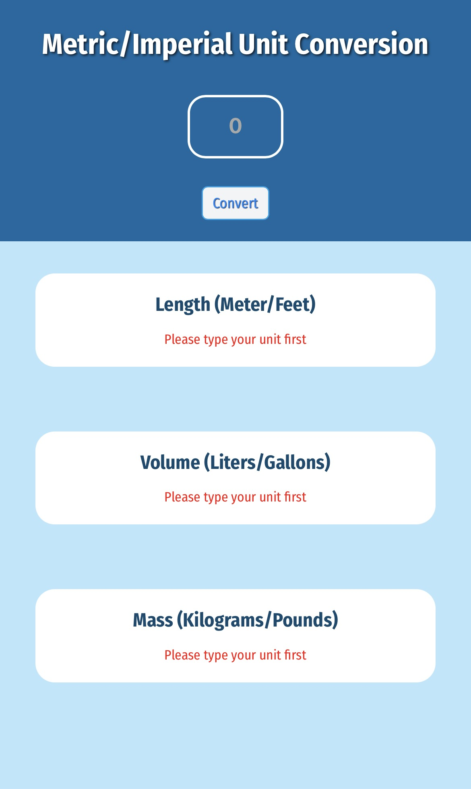
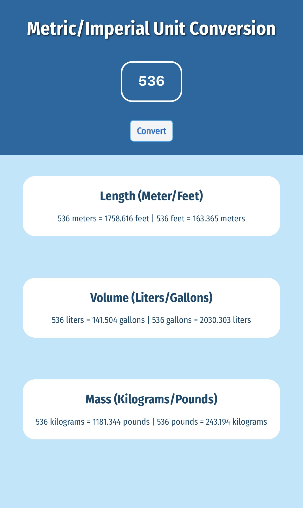

# Unit Converter (SCRIMBA Project)

A simple, responsive web app to convert between metric and imperial units. Built as part of a SCRIMBA course project and a personal learning project to practice DOM manipulation, Flexbox layout, and JavaScript logic.

## Features
- Converts between:
  - Meters ↔ Feet
  - Liters ↔ Gallons
  - Kilograms ↔ Pounds
- Displays both conversion directions simultaneously
- Clean, modern UI with responsive design
- No dependencies or build tools required

## Usage
1. Clone or download this repository.
2. Open `index.html` in your web browser.
3. Enter a number into the input field and click the "Convert" button.
4. View the converted values for length, volume, and mass.

## Project Structure
- `index.html` – Main HTML file, contains the UI structure
- `index.css` – Styles for layout, colors, and responsiveness
- `index.js` – JavaScript logic for unit conversion and DOM updates

## How it works
- The app uses fixed conversion rates:
  - 1 meter = 3.281 feet
  - 1 liter = 0.264 gallon
  - 1 kilogram = 2.204 pound
- When the button is clicked, the input value is converted in both directions and displayed in separate result boxes.
- Input validation ensures that empty or invalid entries show a helpful message.

## Customization
- To change conversion rates, edit the constants in `index.js`.
- To modify layout or colors, adjust styles in `index.css`.
- To add more units or categories, extend the HTML and JS logic accordingly.

## Screenshot

  
  
  

## License
MIT

---
This project was created as part of the SCRIMBA Frontend Developer Career Path and as part of a personal frontend learning journey.
